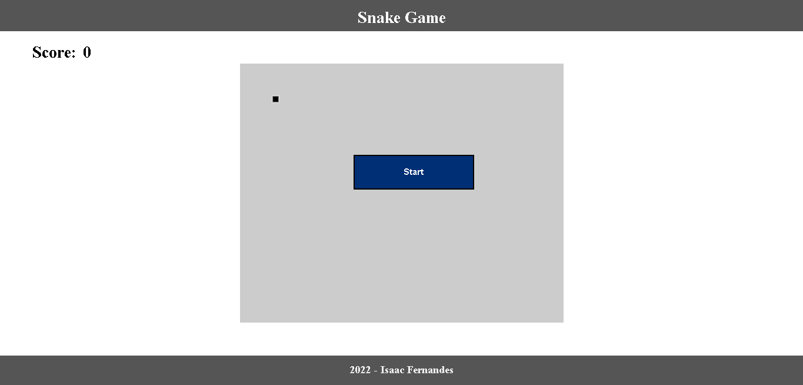
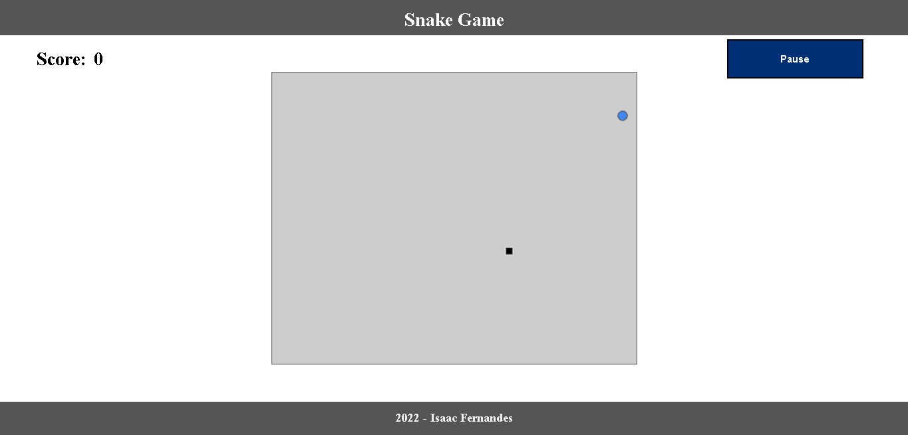
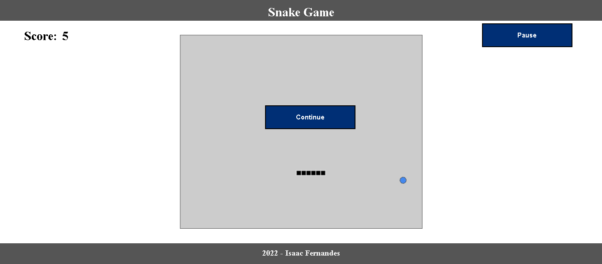
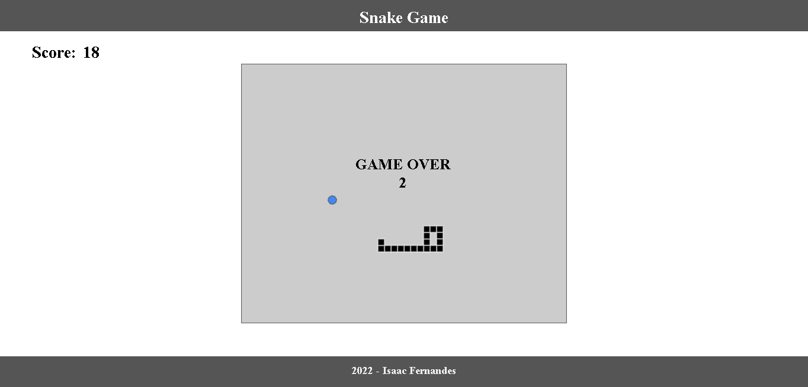

# **SNAKE GAME**

## **Nesse projeto foi desenvolvido o jogo da cobra, um jogo que ultrapassou muitas gerações, ele conta com um botão de start que ao clicar o jogo vai começar, uma vez que iniciar o jogo vai aparecer um botão de pausar e um contador de pontos.**
 

 

## **Ao comer a primeira comida muitas outras serão geradas ao longo do mapa ou seja haverá uma comida no campo simultaneamente, conforme vamos comendo as comidas, a cobra vai crescer,gamhar pontos e ficar mais rápido.**

## **Quando clicar em pausar, o jogo vai parar e vai aparecer um botão para continuar o jogo.**

 

## **Só é game over quando a cobra toca na parede ou se ela bater em seu próprio corpo, no momento do game over aparece um contador de 5 segundos então o jogo volta para sua página inicial**

 

## **Esse projeto foi feito com HTML, CSS, Javascript, arrays, canvas entre outras funções, em breve vou está atualizando ele com uma responsividade para todas as telas e um novo design.**
 

# **links para contato:**

- ## **GitHub: https://github.com/Isaac-Fernandes**
- ## **E-mail: fernandes_isaac100@hotmail.com**
- ## **Instagram: https://www.instagram.com/isaac_fernandes1309/**
 

# **Autor:**
## **Isaac Fernandes dos Santos**